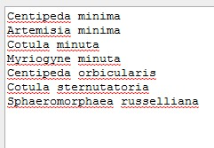
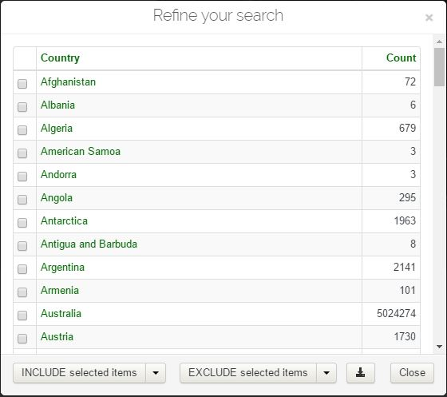
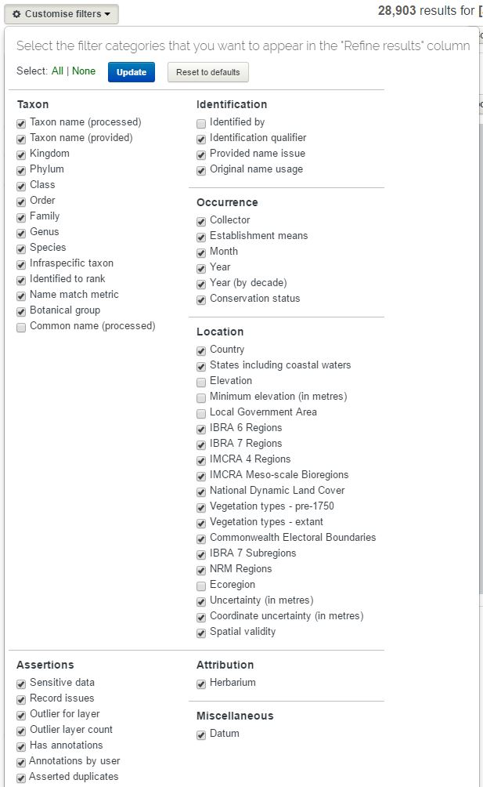
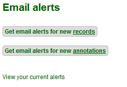
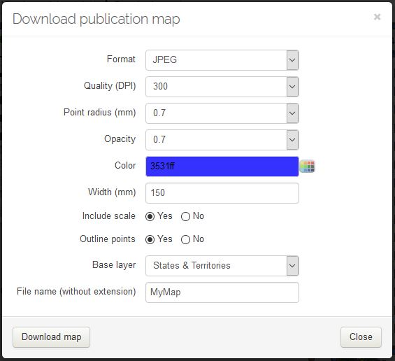
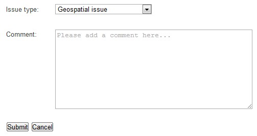
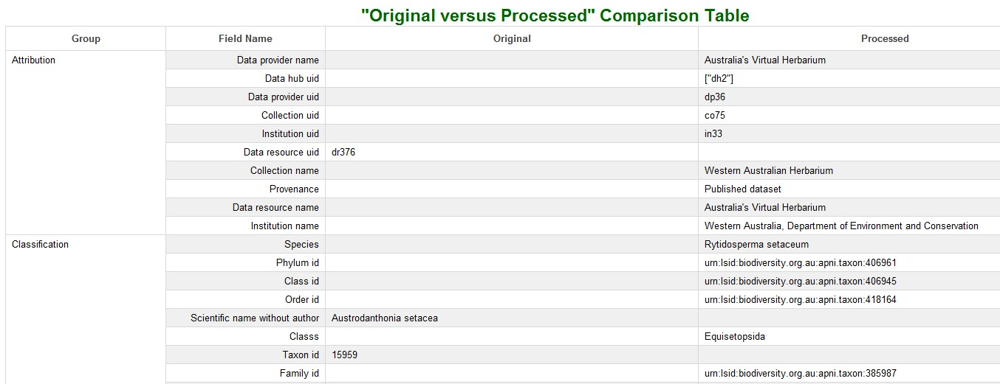

# Using AVH

## Registration and login

No registration or login is needed to browse data from the Australasian Virtual Herbarium; all data, except for data of certain taxa that are sensitive for conservation or biosecurity reasons, is accessible to everyone. We do, however, encourage all users to [register](https://auth.ala.org.au/userdetails/registration/createAccount), as registration allows you to download data and provides access to some extra features, such as reporting an issue with an AVH record or signing up for e-mail alerts. Also, the AVH remembers some of your preferences during your session and, if you log in, stores a cookie on your machine, so your session lasts until the cookie expires or is deleted.

The AVH is part of the Atlas of Living Australia (ALA), so if you already have an ALA user account, you don’t need to register separately for the AVH, but can log in using your ALA account details.

## Search

There are five main search options for querying AVH data. The Quick search allows you to quickly perform a search using a single search term. The Advanced search allows you to perform a more structured query using one or more criteria. The Batch name search and Batch catalogue number search allow you to query by multiple taxon names and multiple catalogue numbers respectively. The Spatial search allows you to query by either a user-defined area or by a polygon defined in a shapefile.

Information on how the different search options work is provided below. See the [Data](http://avh.chah.org.au/index.php/help/data) page for descriptions of the data associated with each of the query terms.

### Quick search

The Quick search first attempts to match the search term against a standard list of botanical names and common names. If no matches are found, a match will be attempted against the taxon names provided with the specimen records. If there is still no match, a full text search will be performed against the following fields: [Herbarium name](http://avh.chah.org.au/index.php/help/data#herbarium), [Herbarium code](http://avh.chah.org.au/index.php/help/data#herbarium_code), [Catalogue number](http://avh.chah.org.au/index.php/help/data#catalogue_number), [Collector](http://avh.chah.org.au/index.php/help/data#collector), [Determiner](http://avh.chah.org.au/index.php/help/data#determiner) and [Collecting notes](http://avh.chah.org.au/index.php/help/data#collecting_notes).

### Advanced search

The Advanced search allows you to perform a structured query using one or more criteria. The data fields you can query on are explained in some detail on the [Data](http://avh.chah.org.au/index.php/help/data) page.

#### Taxon name

The Taxon name search attempts to match the search term against a standard list of botanical names and common names. If no matches are found, a match will be attempted against the taxon names provided with the specimen records ([Taxon name (provided)](http://avh.chah.org.au/index.php/help/data#taxon_names_in_AVH)). The taxon name search term can be combined with other search terms in the Advanced search.

Taxon names can be botanical names of any rank, or common names. Common names are not provided with the AVH data and are not a reliable means of querying AVH records.

You can enter up to four taxon names in the Advanced search. If you want to query on more than four taxon names at the one time, use the Batch name search; you can then use the facets on the results page to add more search terms to your query.

#### Full text search

Unlike the other items in the Advanced search tab, Full text search will try to locate the entered string in a number of fields. These include [Herbarium name](http://avh.chah.org.au/index.php/help/data#herbarium), [Herbarium code](http://avh.chah.org.au/index.php/help/data#herbarium_code), [Catalogue number](http://avh.chah.org.au/index.php/help/data#catalogue_number), [Collector](http://avh.chah.org.au/index.php/help/data#collector), [Determiner](http://avh.chah.org.au/index.php/help/data#determiner) and [Collecting notes](http://avh.chah.org.au/index.php/help/data#collecting_notes).

The Full text search will match the parts of the search string to entire words, but you can add a wildcard (‘\*’) to the last part of the string to match to the start of words. By default, the Full text search will split the search string into its parts and will match to strings where the matched words are separated from each other by text or are in a different order than the parts of the search string. To avoid this behaviour you can enclose the search string in double quotes. Wildcards in quoted strings will be ignored. Individual words in a search string will be matched to pluralised forms of the word. For example, ‘cow’ will return records with ‘cows’ in it.

### Batch name search

The Batch name search allows you to perform a query against a list of taxon names. Each taxon name needs to be entered on a separate line in the query box.

The list of names entered in the Batch name search are matched against the unprocessed taxon names provided with the specimen records (Taxon name (provided)). The Taxon name (provided) for infraspecific taxa may include authors after the species name, and may use inconsistent abbreviations for the infraspecific rank (‘subsp.’, ‘ssp.’ etc.). Because of this, you will get the most predictable results from a batch name search if you don’t include author names or names of infraspecific taxa in your list of taxon names. You can then further refine your results using the facets, or by downloading the data and removing any unwanted records.

Unlike the single taxon name searches, the Batch name search only queries on [Taxon name (provided)](http://avh.chah.org.au/index.php/help/data#taxon_names_in_AVH) and will not include synonyms in the results. Therefore, for complete results, all known synonyms need to be included in the batch of names.

### Batch catalogue number search

The Batch catalogue number search allows you to perform a query against a list of catalogue numbers. Each catalogue number needs to be entered on a separate line in the query box. Catalogue numbers must be formatted exactly as they are stored in the AVH; see the [Data page](http://avh.chah.org.au/index.php/help/data#catalogue_number) for a summary of the catalogue number formats used by different herbaria.

### Spatial search

The Spatial search allows you to perform a search by drawing a circle, rectangle or irregular polygon on the map, or uploading a shapefile. Please note that a search is performed only on the first polygon encountered in the shapefile. You will need a tool like OGR Info to find out which polygon is on top. There is also a good chance that the area of interest consists of more than one polygon in the shapefile.

### Auto-complete suggestions

In the Quick search and the Taxon name input in the Advanced search, when you start typing, a drop-down list with suggestions for taxon names will appear. These names come from the ALA name list and, although they are only names of plants, fungi and algae, do not necessarily correspond with names in the AVH. The correspondence between names on the ALA name list and names in the AVH will improve when the National Species Lists have been completed.

## Results

There are three main options for viewing the results of a query: as a list of records, as a distribution map, and as a series of charts that display certain facets of the results. You can narrow down the results of your initial search by selecting values from the facets in the Narrow your results menu on the left-hand side of the page, and the results displayed in the records, map and charts tab will be updated accordingly.

### Narrow your results

The facets in the Narrow your results menu can be used to apply additional search criteria to your result set. Only the first four values will be listed under each of the facet titles on the Results page, but you can view all values in a pop-up window by clicking on ‘choose more’. If there are more than 100 values in the facet, only the first 100 values will initially be loaded, but the next 100 values will load when you scroll to the bottom of the window. By clicking on the column headers you can order the values in a facet alphabetically by value or by decreasing number of records. You can filter by a single value by clicking on that value, or you can use the checkboxes to select up to 15 values and either include only records with the selected values in the results or exclude those records from the results. You can also download a list of all values in the filter by clicking on the download symbol at the bottom of the window.

All filters that have been used will be listed under Selected filters. You can turn individual filters off by clicking on the ‘\[X\]’ following the filter.

By default, most of the available facets are displayed in the sidebar. You can choose which facets you want to display from the drop-down list under Customise filters. Your choice will be remembered during the session.

### Records tab

The Records tab provides a summary of each specimen record. The most recently published (or edited) records will appear at the top of the list (note that these are not necessarily the most recently collected specimens). Clicking on an individual record will open the Record detail page, which provides all available data for that record.

#### Alerts

You can use the Alerts function to be notified when new records that match your search criteria are made available in the AVH, or when new user-contributed annotations are made to records in your search results. You need to be logged in to subscribe to e-mail alerts.

You can choose to receive alerts on a monthly, weekly, daily or hourly basis. In addition to alerts that relate to your search, you can choose to receive alerts when new records, annotations or images of any kind are added to the ALA.

### Map tab

#### Map symbols

You can change the appearance of the map using the controls along the top of the map window:

-   The dots can be differentially coloured by choosing one of the facets from the Colour by drop-down list

-   The Size slider lets you change the size of the dots

-   You can alter the opacity of the dots using the Opacity slider

-   Dots for ‘Colour by’ values can be displayed or hidden by using the checkboxes in the Legend in the top righthand corner of the map.

You can click on points on the map to view details of the corresponding specimen record.

#### Map base

You can change the map base to one of the following using the layer symbol on the left-hand side of the map:

-   road

-   terrain

-   satellite.

#### View in Spatial portal

Clicking on the ‘View in Spatial Portal’ button will open your result set in the ALA Spatial Portal. The Spatial portal has a wide range of tools for performing detailed spatial analysis of your query results (you can also upload your own data set for analysis). A [guide for using the spatial analysis tools](http://www.ala.org.au/spatial-portal-help/getting-started/) is available on the ALA website.

#### Download map

You can download a high-resolution map by clicking on the ‘Download map’ button. In the pop-up window you can select the format, size and resolution of the map; the base layer; and the size, colour and opacity of the map symbols.

### Charts

The Charts tab displays the query results as a series of charts based on a selection of facets. You can filter your results by clicking on a segment in a pie chart or a bar in a bar graph. Clicking on a segment in the pie chart for Taxon, which is the first chart, will not filter your results, but will return a pie chart for the next lower taxonomic level.

### Download

The Download button on the right-hand side of the screen takes you to a page with options for downloading your results as a list of occurrence records, as a species checklist, or as a field-guide. Note that you will be prompted to sign in to your ALA/AVH account before you can download specimen data.

#### Occurrence records

An Occurrence records download gives you a ZIP archive containing a comma separated values (CSV) file of collecting data. Enter your file name (or accept the default file name), then select one of the following download formats:

-   Full Darwin Core – all available [Darwin Core terms](http://rs.tdwg.org/dwc/index.htm)

-   ALA Legacy Data – the fields available in previous versions of the AVH/ALA

-   Customised download – a customisable selection of [Darwin Core terms.](http://rs.tdwg.org/dwc/index.htm)

You also need to select the output file format from the following:

-   CSV – comma-separated values

-   TSV – tab-separated values

-   shapefile – vector-based GIS export format.

The column labels in the output files are shared with other ALA applications and are not always the same as elsewhere in the AVH.

#### Species checklist

A comma separated values (CSV) file, listing the distinct species in the occurrence records result set.

#### Species field-guide

A PDF document containing species profile information (including photos and maps) for the list of distinct species in the occurrence record set.

## Record detail

The Record detail page displays comprehensive specimen data for a single record. The content of the different fields is described on the Data page. Date loaded (which appears under the location map) indicates the date the record was provided to the ALA BioCache. Date loaded will change if the specimen record has been edited at the source institution. The Date last processed indicates the date that the record was last changed within the ALA BioCache. This may happen, for instance, when there is a change in the backbone taxonomy or the Sensitive Data Service, or when new environmental layers are loaded, and thus doesn’t represent any change to the specimen data held by the source institution.

Note that any common names listed after the taxon name at the top of the page come from the name lists used by ALA and are not provided with the records.

In addition to the specimen data from the herbaria, you can view additional political boundaries and extensive environmental sampling data that relates to the collecting locality.

### Data quality tests

When AVH data is uploaded into the ALA BioCache, a range of quality assurance checks are performed and potential data issues are flagged. A summary of the data issues is listed on the Record detail page under the Data quality tests heading. The [Data issues](http://avh.chah.org.au/index.php/help/data#data_issues) section of the Data page describes the validation issues associated with AVH data.

### Flag an issue

Users can flag potential issues with specimen records by using the Flag an issue feature on the Record detail page. Data issues detected during processing or flagged by users are available as a facet on the Results page, and can be used to narrow down your search results.

### Contact curator

If you have an enquiry about an individual specimen record, you can click on the Contact curator button to see a list of contacts at the relevant herbarium. Please use the ‘Flag an issue’ feature to highlight potential errors in the specimen data.

### Original vs processed

Where the processed information displayed is different from the data supplied with the record, the original data is also displayed:

You can compare all the processed and original data by clicking on the Original vs processed button.

